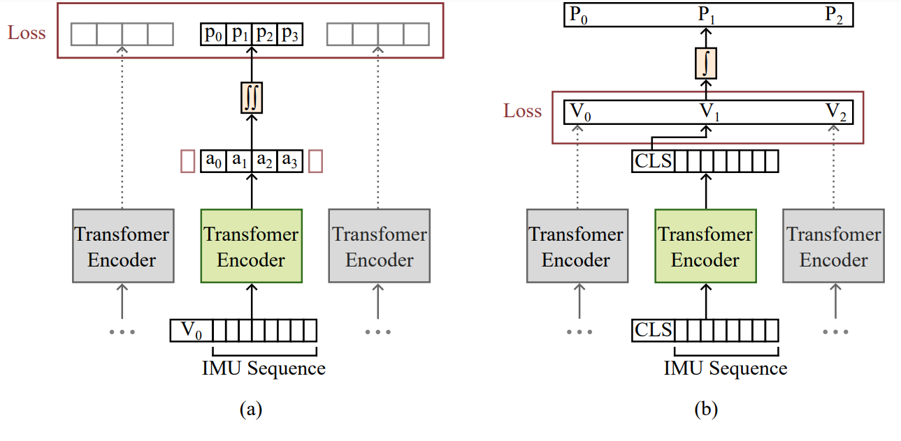

# TRIM - TRansformers for tracking Inertial Measurements

---


Existing methods for inferring pose estimation from IMU
measurements typically employ either multiple IMUs or integrate IMUs
with additional sensors like cameras or LiDAR. Recent work involves
data-driven approaches utilizing deep learning models such as CNNs and
RNNs to predict position from a single IMU. However, these techniques
often specialize in predicting either position or orientation or confine
predictions to 2D space. In this paper, we aim to predict the 6-DoF
pose of an object directly from 6D measurements of a single IMU. We
present transformer-based architectures for direct orientation prediction
and for predicting denoised velocities and accelerations. Our proposed
method is evaluated on the TUM-VIE dataset and demonstrates superior
performance compared to previous models.

### Requirements
python3, numpy, scipy, pandas, matplotlib, torch, torchvision, tqdm

### Data 
The dataset used by this project is the Visual-Inertial Event Dataset (TUM-VIE), which is publicly accesible from https://cvg.cit.tum.de/data/datasets/visual-inertial-event-dataset

### Usage:
1. Clone the repository.
2. Position Networks 
    1. To train/test **RoNIN ResNet** model:
        * run ```src/ronin_resnet_baseline.py``` 
    2. To train/test **RoNIN Transformer**:
        * run ```src/train_transformer_encoder_cls_token.py``` 
3. Heading Network
    * run ```src/train_transformer_quaternions.py``` 

### Acknowledgements
Our work builds upon the following paper:
[Herath, S., Yan, H. and Furukawa, Y., 2020, May. RoNIN: Robust Neural Inertial Navigation in the Wild: Benchmark, Evaluations, & New Methods. In 2020 IEEE International Conference on Robotics and Automation (ICRA) (pp. 3146-3152). IEEE.](https://ieeexplore.ieee.org/abstract/document/9196860)